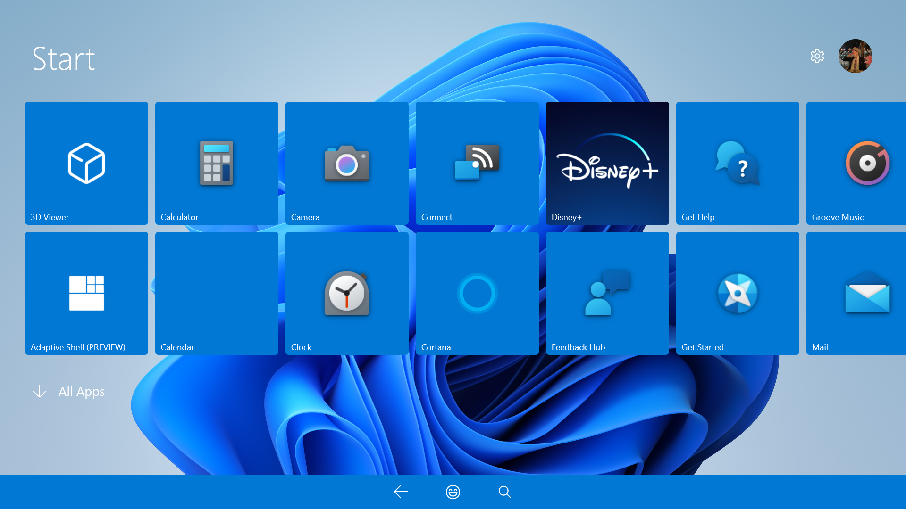
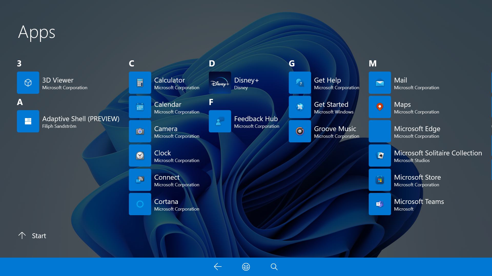
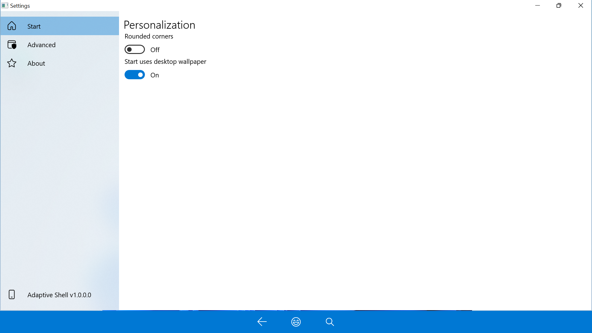

#  Adaptive Shell

An adaptive and modern shell replacement for mobile and tablet computing devices running Windows 11 (with Windows 10 backwards-compatibility).

## User interface

|  |  |  |
| ---------------------------------- | --------------------------------- | ------------------------------------- |
| Start screen                       | All apps                          | Settings                              |

_Screenshot on Surface Pro 2 [dc70ce9](https://github.com/w10m-research/AdaptiveShell/commit/dc70ce9cec578cf9b6a7338596697e6106613123)_
